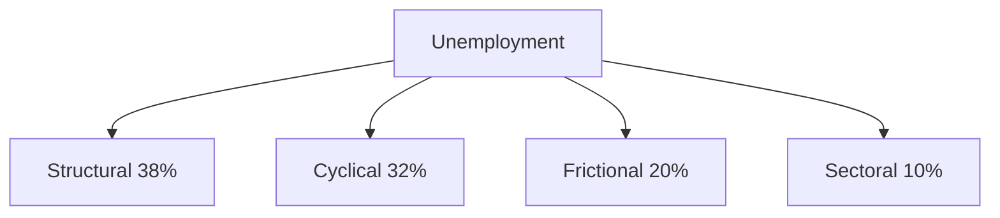

# Full Employment Policy Blueprint - Authored by Emilio Petrozzi

## 1. Executive Summary
Italy faces rising unemployment across key demographics:
- **Overall unemployment**: 6.4% (2020) → 8.7% (2024)
- **Youth unemployment**: 24.6% → 26.5%
- **Long-term unemployment**: 2.5% → 4.6%

This blueprint outlines a comprehensive strategy to achieve full employment through targeted interventions.

## 2. Root Cause Analysis

## 3. Targeted Interventions

### 3.1 Workforce Retraining Programs
- **Objective**: Address structural unemployment
- **Components**:
  - Sector-specific skills development
  - Digital literacy initiatives
  - Career transition support
- **Target**: 100,000 workers annually

### 3.2 Economic Stimulus Measures
- **Objective**: Counter cyclical unemployment
- **Components**:
  - Infrastructure investment
  - SME support grants
  - Green energy transition fund
- **Budget**: €5B over 3 years

### 3.3 Job Matching Infrastructure
- **Objective**: Reduce frictional unemployment
- **Components**:
  - National job portal
  - AI-powered matching algorithm
  - Regional career centers
- **Timeline**: Q3 2025 launch

### 3.4 Education System Reforms
- **Objective**: Bridge skills gaps
- **Components**:
  - STEM curriculum enhancement
  - Apprenticeship mandates
  - Industry-academia partnerships

## 4. Implementation Framework

### Phased Rollout Strategy
| Phase | Timeline | Focus Areas |
|-------|----------|-------------|
| 1 | Q3 2025-Q1 2026 | Stimulus deployment, Job portal launch |
| 2 | Q2 2026-Q4 2026 | Retraining programs, Education reforms |
| 3 | 2027+ | System optimization, Policy refinement |

### Interagency Coordination
- **National Employment Task Force**
- Monthly inter-ministerial reviews
- Regional implementation committees

## 5. Monitoring System

### Key Performance Indicators
1. Unemployment rate reduction (Target: <7% by 2027)
2. Youth employment rate (Target: +15% by 2027)
3. Long-term unemployment reduction (Target: -30% by 2027)

### Evaluation Methodology
- Quarterly impact assessments
- Regional disparity index tracking
- Skills gap analysis

## 6. Stakeholder Engagement

### Engagement Plan
| Stakeholder | Engagement Format | Frequency |
|-------------|-------------------|-----------|
| Government Agencies | Policy coordination meetings | Monthly |
| Educational Institutions | Curriculum workshops | Quarterly |
| Private Sector | Industry roundtables | Bimonthly |
| Labor Unions | Collective bargaining forums | Quarterly |