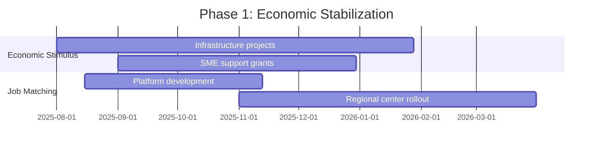
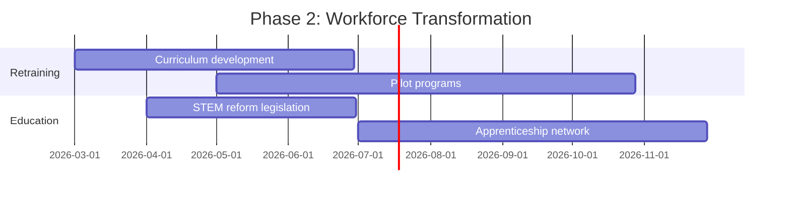

# Full Employment Policy Implementation Roadmap

## Phase 1: Emergency Response (Q3 2025 - Q1 2026)

### Key Milestones
| Milestone | Deadline | Owner | Dependencies |
|-----------|----------|-------|--------------|
| Stimulus package approved | 2025-09-15 | Ministry of Finance | Parliamentary approval |
| Job portal MVP launch | 2025-11-30 | Digital Transformation Team | Technical infrastructure |
| First 20 regional centers operational | 2026-01-31 | Regional Development Agency | Staff training |

### Resource Allocation
| Category | Budget | Personnel |
|----------|--------|-----------|
| Economic stimulus | €2B | 150 FTE |
| Job matching system | €120M | 80 FTE |

## Phase 2: Structural Reforms (Q2 2026 - Q4 2026)

### Key Milestones
| Milestone | Deadline | Owner | Dependencies |
|-----------|----------|-------|--------------|
| Retraining curriculum approved | 2026-06-30 | Education Ministry | Industry consultation |
| STEM reform bill passed | 2026-06-30 | Parliament | Committee review |
| 10,000 apprenticeships launched | 2026-12-31 | Labor Ministry | Employer partnerships |

### Resource Allocation
| Category | Budget | Personnel |
|----------|--------|-----------|
| Workforce retraining | €800M | 200 FTE |
| Education reforms | €500M | 120 FTE |

## Phase 3: System Optimization (2027+)
- **Focus**: Continuous improvement
- **Key Activities**:
  - Policy refinement based on monitoring data
  - Technology system upgrades
  - Expansion to underserved regions
- **Budget**: €300M/year

## Legislative Requirements
1. **Employment Acceleration Act** (Q3 2025)
   - Stimulus funding authorization
   - Regulatory streamlining
2. **Skills Development Act** (Q2 2026)
   - Apprenticeship mandates
   - Training quality standards

## Risk Management
| Risk | Mitigation Strategy |
|------|---------------------|
| Budget shortfalls | Phased funding release |
| Implementation delays | Buffer periods in schedule |
| Regional disparities | Targeted allocation formula |
| Skills mismatch | Continuous industry feedback |