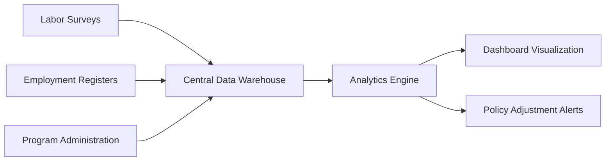

# Monitoring and Evaluation Framework

## 1. Key Performance Indicators

### Core Employment Metrics
| KPI | Measurement Method | Target | Frequency |
|-----|--------------------|--------|-----------|
| **Unemployment Rate** | Quarterly labor force surveys | <7% by 2027 | Quarterly |
| **Youth Employment Ratio** | Youth (15-24) employment data | +15% by 2027 | Quarterly |
| **Long-term Unemployment** | Duration analysis of unemployment registers | -30% by 2027 | Quarterly |
| **Skills Match Index** | Employer-worker skills assessment surveys | 85% alignment | Biannual |

### Program-Specific Metrics
| Program | KPI | Data Source |
|---------|-----|-------------|
| Economic Stimulus | Jobs created per €1M | Project implementation reports |
| Retraining Programs | Employment rate post-training | Training institution follow-ups |
| Job Matching | Time-to-hire reduction | Platform analytics |

## 2. Data Collection System

### Architecture


### Technical Components
1. **Data Integration API**
   - Real-time connection to national statistics systems
   - Secure data transfer protocols
2. **ETL Pipelines**
   - Automated data validation rules
   - Anomaly detection algorithms
3. **Central Data Warehouse**
   - Cloud-based storage (AWS/GCP)
   - GDPR-compliant data management

## 3. Reporting Framework

### Standard Reports
1. **Quarterly Performance Dashboard**
   - Executive summary
   - KPI progress visualization
   - Regional disparity analysis
2. **Program Effectiveness Reports**
   - Cost-per-outcome analysis
   - Participant satisfaction metrics
   - Impact attribution modeling

### Automated Reporting
- Python-based report generation system
- Template:
```python
def generate_quarterly_report(data):
    # Data processing pipeline
    cleaned_data = clean_employment_data(data)
    kpi_calculations = calculate_kpis(cleaned_data)
    
    # Visualization generation
    charts = {
        'unemployment_trend': generate_trend_chart(kpi_calculations),
        'regional_disparities': generate_regional_map(kpi_calculations)
    }
    
    # Report compilation
    compile_pdf_report(kpi_calculations, charts)
```

## 4. Evaluation Methodology

### Impact Assessment
- **Difference-in-Differences Analysis**: Compare intervention regions vs control groups
- **Cost-Benefit Analysis**: ROI calculation for each program
- **Counterfactual Modeling**: Predict outcomes without interventions

### Feedback Loops
1. **Policy Adjustment Triggers**
   - Automatic alerts when KPIs deviate >10% from targets
   - Quarterly policy review panels
2. **Stakeholder Feedback Mechanism**
   - Digital feedback portal
   - Structured consultation forums
   - Sentiment analysis of public discourse

## 5. Implementation Timeline
| Component | Q3 2025 | Q4 2025 | Q1 2026 | Q2 2026 |
|-----------|---------|---------|---------|---------|
| Data infrastructure | Development | Testing | Deployment | Optimization |
| KPI baseline | ✓ | | | |
| Automated reporting | | Prototype | Refinement | Full rollout |
| Evaluation capacity | Training | | Implementation | |