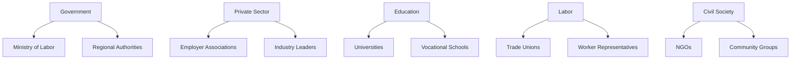

# Stakeholder Engagement Strategy

## 1. Stakeholder Mapping


## 2. Engagement Objectives
1. **Government**: Policy coordination and resource alignment
2. **Private Sector**: Job creation commitments and skills feedback
3. **Education**: Curriculum co-development and placement support
4. **Labor**: Worker protection advocacy and transition support
5. **Civil Society**: Community outreach and vulnerable group inclusion

## 3. Engagement Matrix

### Government Agencies
| Method | Frequency | Responsible | Key Topics |
|--------|-----------|-------------|-----------|
| Inter-ministerial committee | Monthly | Policy Director | Cross-agency coordination |
| Regional implementation meetings | Quarterly | Regional Coordinators | Local adaptation |
| Legislative briefings | As needed | Legal Team | Regulatory requirements |

### Private Sector Partners
| Method | Frequency | Responsible | Key Topics |
|--------|-----------|-------------|-----------|
| Industry roundtables | Bimonthly | Business Liaison | Skills needs, Hiring plans |
| Sector working groups | Quarterly | Program Managers | Program co-design |
| CEO advisory council | Semiannual | National Coordinator | Strategic direction |

### Educational Institutions
| Method | Frequency | Responsible | Key Topics |
|--------|-----------|-------------|-----------|
| Curriculum workshops | Quarterly | Education Lead | Skills alignment |
| Apprenticeship coordination | Monthly | Workforce Development | Placement systems |
| Research partnerships | Ongoing | Policy Research | Impact evaluation |

### Labor Organizations
| Method | Frequency | Responsible | Key Topics |
|--------|-----------|-------------|-----------|
| Collective bargaining | Quarterly | Labor Relations | Worker protections |
| Transition support forums | Monthly | Retraining Team | Job displacement |
| Policy feedback sessions | Biannual | Engagement Manager | Program improvements |

## 4. Communication Protocol

### Core Principles
- **Transparency**: Publish meeting minutes within 5 working days
- **Accessibility**: Multilingual materials and disability accommodations
- **Responsiveness**: Acknowledge input within 48 hours

### Channels
| Audience | Primary Channel | Secondary Channel |
|----------|----------------|-------------------|
| Government | Secure portal | In-person meetings |
| Businesses | Dedicated email | Webinars |
| Education | Online platform | Workshops |
| Workers | Mobile app | Union bulletins |
| Public | Social media | Community meetings |

## 5. Feedback Integration
1. **Digital Feedback Hub**
   - Centralized input repository
   - Automated sentiment analysis
   - Thematic clustering
2. **Response Workflow**
   ```mermaid
   sequenceDiagram
       Participant S as Stakeholder
       Participant F as Feedback System
       Participant T as Technical Team
       Participant P as Policy Team
       S->>F: Submit feedback
       F->>T: Automatic triage
       T->>P: Escalate policy issues
       P->>F: Response drafted
       F->>S: Acknowledgement + response
   ```

## 6. Conflict Resolution
- **Mediation Protocol**: 
  1. Informal discussion (Facilitator)
  2. Formal mediation (Third-party)
  3. Arbitration panel (Binding decision)
- **Timeline**: Resolution within 30 days of escalation

## 7. Implementation Timeline
| Activity | Q3 2025 | Q4 2025 | 2026 |
|----------|---------|---------|------|
| Stakeholder mapping | ✓ | Update | Review |
| Engagement launch | Initial meetings | Full rollout | Refinement |
| Feedback system | Development | Testing | Optimization |
| Conflict resolution | Framework | Training | Activation |